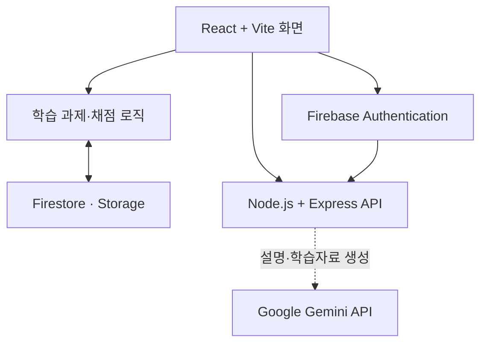

# MakerOS

> **마이스터고 입학 후 공부 방향을 잡지 못한 학생이 학교 공부와 CBT를 꾸준히 이어가도록 돕는 학습 습관 도우미**

MakerOS는 학교 시험과 자격증 준비를 따로 관리해야 하는 마이스터고 학생에게 오늘 할 수 있는 작은 학습 과제를 제안하고, 수행 기록을 다음 학습으로 연결하는 서비스입니다.

- 서비스: [https://makeros.onrender.com](https://makeros.onrender.com)
- 저장소: [https://github.com/jiuhan1226/makeros](https://github.com/jiuhan1226/makeros)
- 참가 분야: AI × 교육·학습
- 대회: 제4회 NAVER OGQ마켓 AI Competition

## 1. 해결하려는 문제

마이스터고 학생은 일반 교과, 전공 교과와 국가기술자격 준비를 함께 해야 합니다. 학교 시험과 기능사 필기 일정이 가까워지면 공부할 내용이 한꺼번에 늘어나지만, 입학 후 자신에게 맞는 공부 방법을 아직 만들지 못한 학생은 다음과 같은 결정을 매일 혼자 내려야 합니다.

- 오늘 학교 공부와 자격증 공부 중 무엇을 먼저 할지
- 남은 시간에 어느 정도의 분량을 공부할지
- 이전에 끝내지 못한 내용과 틀린 문제를 언제 다시 볼지
- 여러 자료에 흩어진 학습 기록을 어떻게 이어갈지

계획을 크게 세우는 것보다 실제로 공부를 시작하고 다시 돌아오는 경험이 먼저 필요합니다. MakerOS는 오늘 할 일을 작은 단위로 제안하고, 완료 경험을 반복해 학생이 자신의 학습 습관을 만들도록 돕습니다.

### 핵심 페르소나

| 항목 | 내용 |
|---|---|
| 주요 사용자 | 마이스터고 1학년 중 자기주도 학습 방법을 아직 정립하지 못한 학생 |
| 학습 상황 | 일반·전공 수업과 기능사 준비를 병행함 |
| 어려움 | 공부 순서와 분량을 결정하기 어렵고 계획을 꾸준히 이어가기 어려움 |
| 필요한 도움 | 오늘 바로 시작할 수 있는 작은 과제와 완료 기록 |

## 2. MVP

### 핵심 행동

> **학생이 자신에게 제안된 오늘의 작은 학습 과제를 수행한다.**

### 사용자 흐름

```text
학교 시험일·기능사 시험일·오늘 가능한 시간 입력
→ 오늘의 학습 과제 1~2개 확인
→ 학교 공부 또는 CBT 수행
→ 완료·정오답·자기평가 기록
→ 다음 학습 과제에 반영
```

시간이 부족한 날에는 학교 공부와 CBT를 모두 강제하지 않습니다. 시험일까지 남은 기간, 미완료 학습과 최근 오답을 기준으로 더 필요한 한 가지를 먼저 제안하며, 학생이 분량을 줄일 수 있습니다.

### 이번 MVP에 포함할 기능

| 구분 | 범위 |
|---|---|
| 최소 입력 | 학교 시험일, 기능사 시험일, 오늘 가능한 시간, 학습 과목·단원 |
| 오늘의 학습 | 기한·미완료·최근 오답을 기준으로 과제 1~2개 제안 |
| 학교 공부 | 선택 과목 1개·단원 1개, 자료 확인, 핵심 내용 떠올리기, 완료 기록 |
| CBT | 기능사 1종목, 검수한 소규모 문항 풀이, 채점, 오답 재학습 |
| 공통 기록 | 시작·완료 시각, CBT 정오답, 학교 공부 자기평가 저장 |
| 다음 행동 | 완료 기록과 오답을 다음 과제의 순서와 분량에 반영 |

### 사람이 직접 운영할 부분

- 파일럿 대상 과목과 기능사 종목 선정
- 학교 학습자료와 CBT 문항의 이용 권리 확인
- 문항·정답·해설 검수
- 초기 학습 분량 조정

### 이번 MVP에서 제외할 기능

- 전 과목·전 자격증 지원
- 기출문제 자동 수집
- 발명 코치, 진로, 포트폴리오
- 커뮤니티와 랭킹
- 전용 관리자 대시보드
- 고도화된 알림과 통계

## 3. 검증 계획

새 페르소나에 맞는 학생 5명을 대상으로 7일 동안 파일럿을 진행합니다.

| 확인할 지표 | 측정 방법 |
|---|---|
| 시작 시간 | 오늘의 과제를 본 뒤 첫 학습을 시작하기까지 걸린 시간 |
| 과제 완료율 | 제안된 과제 중 완료한 과제의 비율 |
| 학습 날짜 수 | 7일 중 한 가지 이상의 과제를 완료한 날짜 수 |
| 사용 경험 | 공부할 내용을 정하기 쉬웠는지, 분량이 적절했는지 인터뷰 |

1차 판단 기준은 5명 중 3명 이상이 7일 동안 4일 이상 과제를 수행하는 것입니다. 짧은 파일럿에서는 장기 습관 형성보다 시작과 반복 사용 가능성을 확인합니다.

## 4. 아키텍처



### 구성 요소

| 영역 | 역할 |
|---|---|
| React + Vite | 오늘의 과제, 학교 공부, CBT, 완료 결과 화면 |
| 학습 로직 | 과제 우선순위, CBT 채점, 완료 이벤트와 다음 학습 계산 |
| Firebase Authentication | 사용자 로그인과 UID 발급 |
| Firestore / Storage | 일정, 과제, 수행 기록, 검수된 콘텐츠 저장 |
| Node.js + Express | 사용자 토큰 확인, AI 요청 제한과 오류 처리 |
| Google Gemini API | CBT 설명, 학습자료와 튜터 응답 생성 보조 |

### 코드와 AI의 역할

공식 정답, 점수, 완료 여부, 복습일과 일일 권장량은 규칙 기반 코드가 계산합니다. AI는 문장을 만들거나 학습 내용을 설명하는 작업을 보조합니다.

```text
공식 정답 고정
→ AI 해설 초안 생성
→ 별도 검증
→ 코드에서 정답 일치 여부 확인
→ 검증된 해설만 표시
```

AI 호출이 지연되거나 실패해도 검수된 문제·정답과 기본 학습 과제로 학습을 이어갈 수 있도록 구성합니다.

자세한 기술 구조는 [ARCHITECTURE.md](./ARCHITECTURE.md)에서 확인할 수 있습니다.

## 5. 데이터 원칙

| 데이터 | 저장 내용 | 처리 원칙 |
|---|---|---|
| 학습 일정 | 시험일, 가능한 시간, 선택 과목·종목 | 학습 제안에 필요한 정보만 저장 |
| 학습 과제 | 학교 공부·CBT 구분, 단원, 분량, 상태 | 사용자가 분량을 조절할 수 있음 |
| 학습 이벤트 | 가명 UID, 시작·완료 시각, 답안, 자기평가 | 사용자별 경로에 분리하여 저장 |
| 콘텐츠 | 문항, 정답, 출처, 검수 상태 | 권리가 확인된 자료만 사용 |
| AI 결과 | 생성 내용, 모델 정보, 검수 상태 | AI 생성 사실을 표시하고 공식 정답을 우선함 |

학교 공부의 자기평가와 CBT 정답률은 서로 다른 데이터로 기록합니다. 원본 학습 이벤트를 보존하여 통계가 잘못 계산되었을 때 다시 계산할 수 있도록 합니다.

## 6. 기술 스택

| 구분 | 기술 |
|---|---|
| Frontend | React 18, Vite 6, CSS |
| Backend | Node.js 22, Express 4 |
| Database | Cloud Firestore |
| Authentication | Firebase Authentication |
| Storage | Firebase Storage |
| AI | Google Gemini API, `@google/genai` |
| PDF | PDF.js |
| Deployment | Docker, Render |
| Security | Firebase ID Token, Helmet, CORS, Rate Limiting, HMAC |

## 7. 실행 방법

### 필요한 환경

- Node.js 22.x
- npm
- Firebase 프로젝트
- Google Gemini API 키

### 설치

```bash
git clone https://github.com/jiuhan1226/makeros.git
cd makeros
npm ci
cp .env.example .env
```

Windows PowerShell에서는 다음 명령으로 환경변수 파일을 만듭니다.

```powershell
Copy-Item .env.example .env
```

### 주요 환경변수

| 구분 | 변수 |
|---|---|
| 서버 | `GEMINI_API_KEY`, `GEMINI_MODEL`, `FIREBASE_PROJECT_ID` |
| 서버 보호 | `ALLOWED_ORIGINS`, `ALLOW_UNAUTHENTICATED_AI`, `EXPLANATION_SIGNING_SECRET` |
| Firebase 웹 | `VITE_FIREBASE_API_KEY`, `VITE_FIREBASE_AUTH_DOMAIN`, `VITE_FIREBASE_PROJECT_ID`, `VITE_FIREBASE_STORAGE_BUCKET`, `VITE_FIREBASE_MESSAGING_SENDER_ID`, `VITE_FIREBASE_APP_ID` |

실제 키와 비밀번호는 `.env` 또는 배포 환경변수에만 입력합니다.

### 개발 실행

```bash
npm run dev
```

- Web: `http://localhost:5173`
- API: `http://localhost:8787`

### 검사와 빌드

```bash
npm run check
npm run test:learning
npm run test:explanation
npm run test:maintenance
npm run test:copy
npm run test:responsive
npm run build
```

### 프로덕션 실행

```bash
npm start
```

배포 설정은 [Dockerfile](./Dockerfile), [render.yaml](./render.yaml), [DEPLOY_RENDER.md](./DEPLOY_RENDER.md)에서 확인할 수 있습니다.

## 8. AI 사용 내역

### 제품에서 사용한 AI

- 제공자: Google
- SDK: `@google/genai`
- 기본 모델 설정: `gemini-3.5-flash-lite`
- 사용 기능: CBT 해설, 취약 개념 설명, PDF 학습자료, AI Tutor, 학습 코칭

AI는 공식 정답과 점수를 변경하지 않습니다. 생성 결과는 정답 일치 검사와 검증 절차를 통과한 경우에만 표시합니다.

### 개발 과정에서 사용한 AI

| 도구 | 사용 내용 |
|---|---|
| ChatGPT / OpenAI | 요구사항 정리, MVP 범위 재정의, 코드 검토, 오류 분석, UI 문구와 문서 작성 보조 |
| Google Gemini | 제품 내 생성 기능 구현과 응답 형식 확인 |

AI가 만든 코드와 문서는 팀이 직접 실행하고 검토한 뒤 수정했습니다. 자세한 내용은 [AI_USAGE_DISCLOSURE.md](./AI_USAGE_DISCLOSURE.md)에서 확인할 수 있습니다.

## 9. 보안 점검

- 코드와 GitHub 저장소에 실제 API 키가 보이지 않는 것을 확인했습니다.
- 코드와 GitHub 저장소에 실제 비밀번호가 보이지 않는 것을 확인했습니다.
- `.env`는 `.gitignore`와 `.dockerignore`에 포함되어 있습니다.
- 서버용 키는 `VITE_` 접두사를 사용하지 않고 서버 환경변수에서 불러옵니다.

## 10. 오픈소스와 라이선스

팀이 작성한 코드는 [MIT License](./LICENSE)로 공개합니다.

| 라이선스 | 주요 패키지 |
|---|---|
| MIT | React, React DOM, Vite, React Plugin, Express, CORS, Express Rate Limit, Helmet, concurrently |
| Apache-2.0 | Google Gen AI SDK, Firebase, Firebase Admin, PDF.js, TypeScript |
| BSD-2-Clause | dotenv |

- 저장소에는 별도의 외부 이미지·폰트 파일이 포함되어 있지 않습니다.
- 기출문제, PDF, 이미지와 학습자료는 저장소의 MIT License에 포함되지 않습니다.
- CBT 문항과 학습자료는 이용 권리와 출처를 확인한 뒤 사용합니다.

## 11. 외부 참고

- [스타프로젝트 W3 · MVP·아키텍처·AI 윤리](https://meister.itshin.com/workshop/w3/): MVP 범위, 아키텍처, AI 사용 및 라이선스 체크 기준 참고
- 지도교사·멘토 등 추가 외부 자문을 받은 경우 내용과 기여 범위를 이 항목에 기록합니다.

## 12. 팀

| 이름 | 역할 |
|---|---|
| 한지우 | PM, 서비스 기획, 팀 통합 |
| 김태형 | 프론트엔드, UX/UI |
| 김현수 | AI, 백엔드, 데이터 |
| 김예성 | 사용자 검증, 콘텐츠, QA |

---

MakerOS는 많은 기능을 한 번에 제공하는 것보다, 학생이 오늘의 작은 학습 과제를 실제로 끝내고 다음 날 다시 돌아오는 경험을 먼저 검증합니다.
